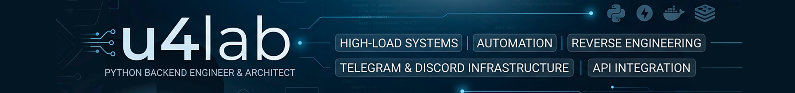

  

<b>🇷🇺 Показать версию на русском языке</b>

 

# 👨‍💻 u4lab | Backend Engineer & Bot Infrastructure Architect

Проектирую и внедряю сложные распределенные системы, автоматизацию бизнес-логики и высоконагруженные мосты между платформами. Мой фокус — **Performance**, **Scalability** и **Reverse Engineering**.

---

### 🛠 Tech Stack

* **Core:** Python 3.11+ (Asyncio), C++ (Basics)
* **Frameworks:** FastAPI, Aiogram 3.x, Discord.py, Starlette
* **Data:** PostgreSQL (SQLAlchemy / Asyncpg), MongoDB (Motor), Redis (FSM & Caching)
* **Ops:** Docker & Compose, Poetry, Nginx, CI/CD, Linux Server Management
* **Expertise:** API Reverse Engineering, Multi-tenant Architecture, Media Processing Pipelines, Message Routing Systems.

---

### 🏗 Key Projects & Expertise

#### 🔒 DocPulse PA-2.0 (Private Framework)
**Professional Parser Agent Infrastructure**
* Разработал модульный фреймворк для управления жизненным циклом парсер-агентов (Runtime: Start/Stop/Status).
* Внедрил систему `DirectSender` с механизмом экспоненциальных повторов (Exponential Backoff) для гарантированной доставки данных в бэкенд.
* Реализовал изолированный `MediaManager` для валидации, обработки и ротации временных медиа-файлов.

#### 🚀 AMultibot
**High-Efficiency Multi-tenant Gateway**
* Архитектура для запуска неограниченного количества независимых ботов на одном инстансе FastAPI.
* Динамическая регистрация вебхуков и изоляция данных между инстансами.
* Оптимизация ресурсов: общая бизнес-логика при раздельных контекстах данных.

#### 🕊 TWFeed & Disresend
**Cross-Platform Integration & Reverse Engineering**
* **TWFeed:** Построил систему доставки контента из Twitter/X без использования официального API. Внедрил рендеринг твитов в PNG через Playwright для сохранения оригинального визуального стиля.
* **Disresend:** Enterprise-решение для синхронизации Discord и Telegram. Сложная обработка Markdown-разметки, вложений и трансляция Cross-Replies между несовместимыми API.
* Использование мультипроцессности (DPC) для обеспечения стабильности парсеров.

#### 💬 [MsgRelayBot](https://github.com/u4lab/msgrelaybot)
**Customer Support Infrastructure**
* Система двустороннего релея сообщений (CRM-like) на базе Telegram Forum Topics.
* Архитектура «один топик = один клиент», позволяющая вести сотни диалогов внутри одной группы.
* Полная интернационализация (i18n) и управление конфигурацией через ENV для быстрой кастомизации.

---

### 📊 Engineering Philosophy

- **Clean Code:** Предпочитаю строгую типизацию и следование принципам SOLID.
- **Robustness:** Любая внешняя интеграция должна иметь механизмы обработки ошибок и автоматического восстановления.
- **Security:** Безопасное хранение токенов и шифрование чувствительных данных.

---

### 📞 Connect with me
* **News & Tech:** [@u4_studio](https://t.me/u4_studio)
* **Contact & Info:** [@u4_about](https://t.me/u4_about)

---

 

# 👨‍💻 u4lab | Backend Engineer & Bot Infrastructure Architect

I design and implement complex distributed systems, business logic automation, and high-load bridges between platforms. My focus is on **Performance**, **Scalability**, and **Reverse Engineering**.

---

### 🛠 Tech Stack

* **Core:** Python 3.11+ (Asyncio), C++ (Basics)
* **Frameworks:** FastAPI, Aiogram 3.x, Discord.py, Starlette
* **Data:** PostgreSQL (SQLAlchemy / Asyncpg), MongoDB (Motor), Redis (FSM & Caching)
* **Ops:** Docker & Compose, Poetry, Nginx, CI/CD, Linux Server Management
* **Expertise:** API Reverse Engineering, Multi-tenant Architecture, Media Processing Pipelines, Message Routing Systems.

---

### 🏗 Key Projects & Expertise

#### 🔒 DocPulse PA-2.0 (Private Framework)
**Professional Parser Agent Infrastructure**
* Developed a modular framework for managing the lifecycle of parser agents (Runtime: Start/Stop/Status).
* Implemented the `DirectSender` system with an exponential backoff mechanism for guaranteed data delivery to the backend.
* Implemented an isolated `MediaManager` for validation, processing, and rotation of temporary media files.

#### 🚀 AMultibot
**High-Efficiency Multi-tenant Gateway**
* Architecture for running an unlimited number of independent bots on a single FastAPI instance.
* Dynamic webhook registration and data isolation between instances.
* Resource optimization: shared business logic with separate data contexts.

#### 🕊 TWFeed & Disresend
**Cross-Platform Integration & Reverse Engineering**
* **TWFeed:** Built a content delivery system from Twitter/X without using the official API. Implemented rendering of tweets to PNG via Playwright to preserve the original visual style.
* **Disresend:** Enterprise solution for synchronizing Discord and Telegram. Complex processing of Markdown formatting, attachments, and Cross-Replies translation between incompatible APIs.
* Utilizing multiprocessing (DPC) to ensure parser stability.

#### 💬 MsgRelayBot
**Customer Support Infrastructure**
* Two-way message relay system (CRM-like) based on Telegram Forum Topics.
* "One topic = one client" architecture, allowing management of hundreds of dialogues within a single group.
* Full internationalization (i18n) and configuration management via ENV for rapid customization.

---

### 📊 Engineering Philosophy

- **Clean Code:** I prefer strict typing and adherence to SOLID principles.
- **Robustness:** Any external integration must have error handling and automatic recovery mechanisms.
- **Security:** Secure token storage and encryption of sensitive data.

---

### 📞 Connect with me
* **News & Tech:** [@u4_studio](https://t.me/u4_studio)
* **Contact & Info:** [@u4_about](https://t.me/u4_about)

---

  

